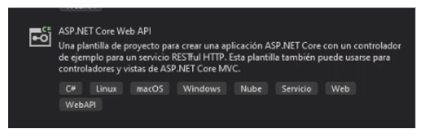
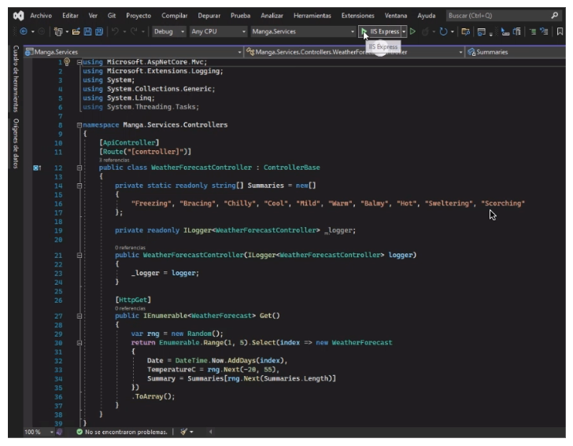
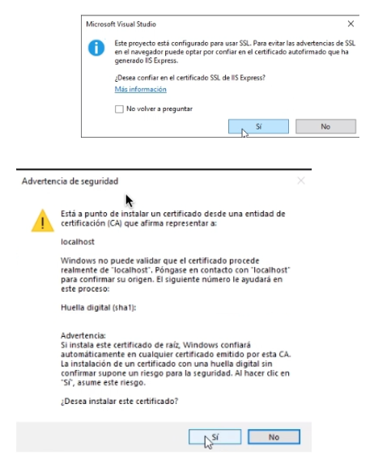

We created an ASP.NET Core Web API project, which we named Manga.Services.

We click on IIS Express to run the project.

The following window appears. We click “Yes,” and another warning window shows up, to which we also click “Yes.”

