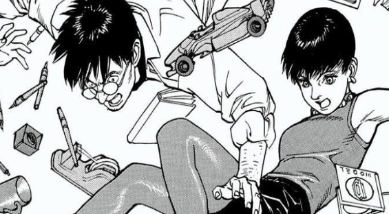
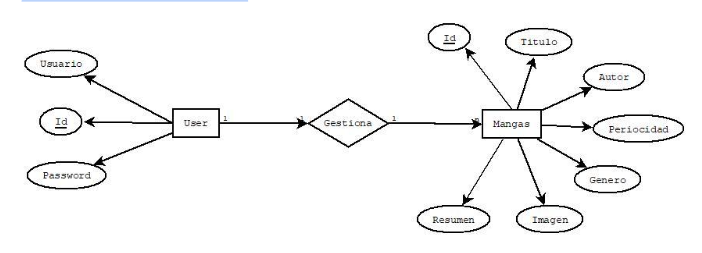
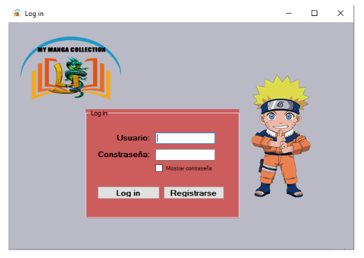
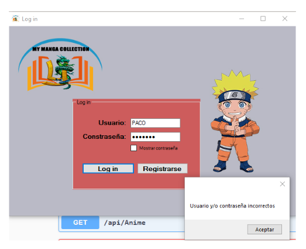
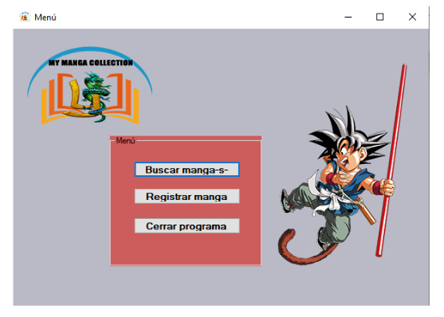

# My-Manga-Collection
A manga collection app for fans to organize and track their physical or digital volumes. With long-running series like One Piece, collectors need an easy way to manage their collections, stay updated, and follow their favorite titles when anime releases lag behind manga.

 

General Objective:

<li> Use Visual Studio to develop a desktop application that enables users to manage their manga collection: search, register, edit, and delete manga entries. </li>

 

Specific Objectives:

<li> Create a user registration system for those who wish to access the application. </li>

<li> Implement a login window for authenticated user access. </li>

<li> Develop a management system that ensures security and prevents execution errors that could crash the application. </li>

<li> Design a user interface that is functional, user-friendly, and visually appealing. </li>

The class diagram describes the structure of a program through its component classes, their attributes, operations, and the relationships between classes.

 

The use case diagram is a graphical description of the system's behavior.

 

Here we will look at the entity-relationship diagram of the database that was created. The components can be represented through an entity-relationship diagram.

 

Navigation Map

 

When the program is launched, the login window opens. The application's logo appears in the upper left corner. The window includes two textboxes for entering the username and password, and below them, a checkbox to show or hide the password. This first part of the application also allows users to click the "Register" button, which opens another similar window where users can create an account to manage their manga collections.

 

When the "Log in" button is pressed, the application checks the username and password in the database. If they match, access to the next window is granted; otherwise, a MessageDialog appears informing the user that their credentials are incorrect.

In this window, there are two textboxes: one for entering the username and another for entering the password. Below them, there is a checkbox to show or hide the password, and finally, a button to complete the registration.

In the next window (after logging in), we can see the main application screen displaying a menu with three buttons: one to search for manga, another to register manga, and a third to close the program from there.

From the menu, we can register as many manga entries as we want. If all fields are filled in, a MessageDialog appears to inform the user that their manga has been successfully registered.

This is the "Search" screen, where we can see several textboxes to search by title, author, chapter, frequency, or genre. To perform the search, click the "Search" button. The results will appear in the ListView below. By clicking on the desired manga and pressing the "Open" button, we can view the complete manga details. There is also a button to go back.

